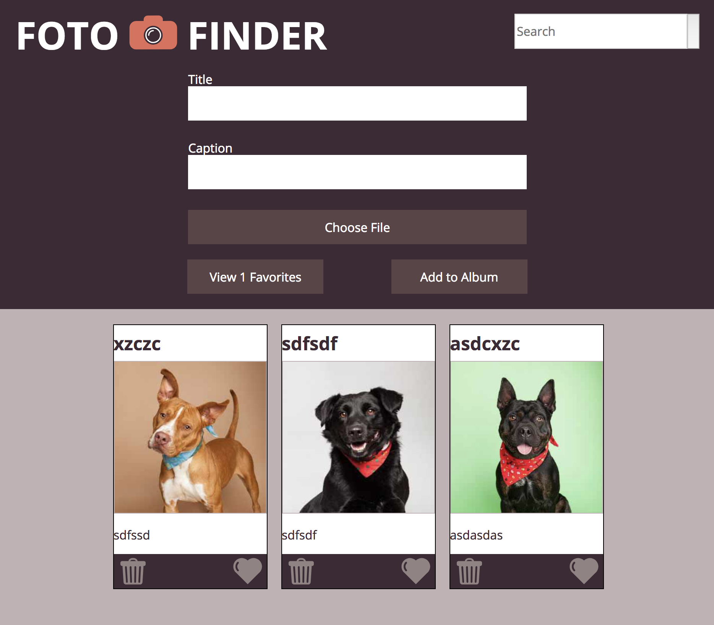
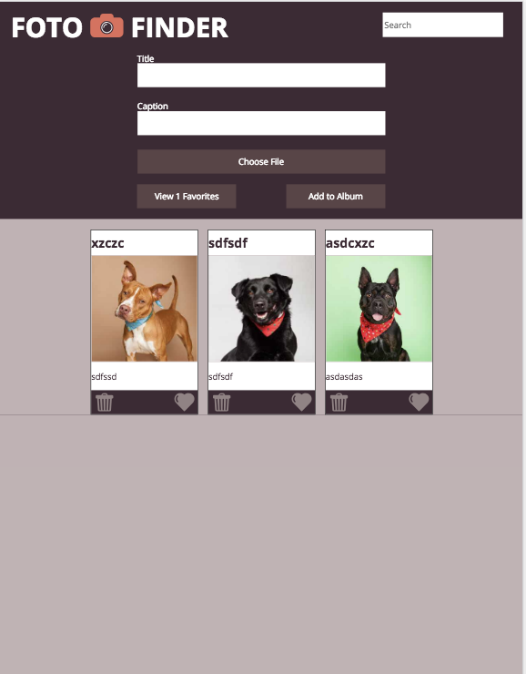

# Foto-Finder
Duy Vu

## Overview
- Used grids to piece up my page.
- Makes page elements responsive
- Used flex to work within the boxes created with grid.
- Used nested grids to edit boxes within grid as well.
- Used filter, find, findIndex array prototypes to search through my arrays.
- Can save to localStorage all of my data used on page.
- Shows only saved elements when "View Favorites" is clicked.
- Can search through card's title and captions via search bar input.
- Can save your selected favorites.
- Can edit text inside each card and save to localStorage.

## Full-Screen

## Mobile-Screen

